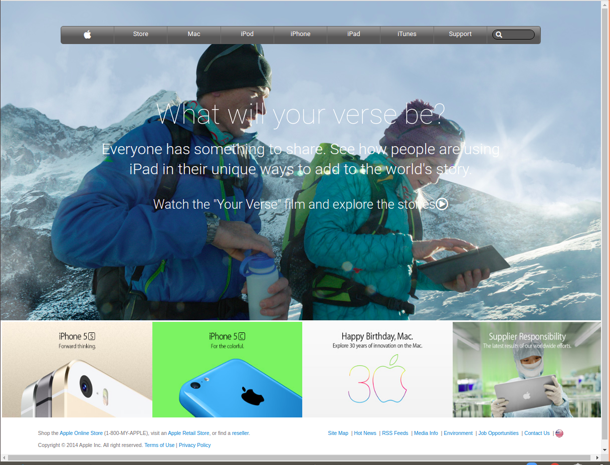

# apple-project

> The apple-project is a clone of the apple.com website by using backgrounds and gradients. 

## Built With

- HTML,
- CSS

## Live Demo

[Live Demo Link](https://rawcdn.githack.com/Mupa1/apple-project/a842b0ac98deb91aefa4e761471740b9310b887c/index.html)

## Author

- Github: [@mupa1](https://github.com/Mupa1)
- Twitter: [@mupa_mmbetsa](https://twitter.com/mupa_mmbetsa)
- Linkedin: [mupa](https://www.linkedin.com/in/mupa)

## 🤝 Contributing

Contributions, issues and feature requests are welcome!

Feel free to check the [issues page](https://github.com/Mupa1/apple-project/issues)

## Show your support

Give a ⭐️ if you like this project!
