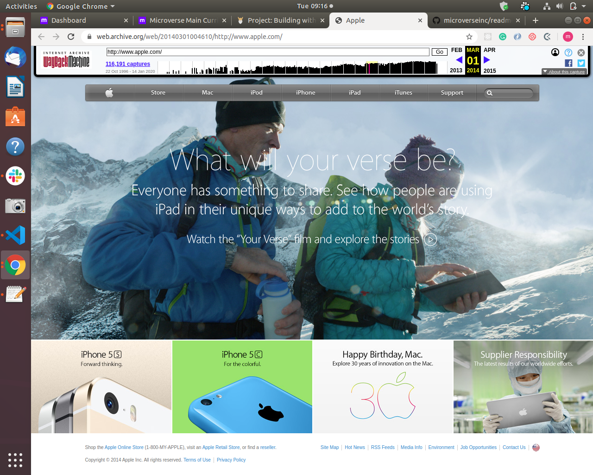

# apple-project

> The apple-project involves cloning apple.com website using backgrounds and gradients similar to the screenshot below. 

## Built With

- HTML,
- CSS

## Author

- Github: [@githubhandle](https://github.com/Mupa1)
- Twitter: [@twitterhandle](https://twitter.com/mupa_mmbetsa)
- Linkedin: [linkedin](https://www.linkedin.com/in/mupa-nzaphila-644788103/)

## 🤝 Contributing

Contributions, issues and feature requests are welcome!

Feel free to check the [issues page](https://github.com/Mupa1/apple-project/issues)

## Show your support

Give a ⭐️ if you like this project!

## Acknowledgments

- Microverse Community
- Standup Team - sandpipers
- ALC 4.0
